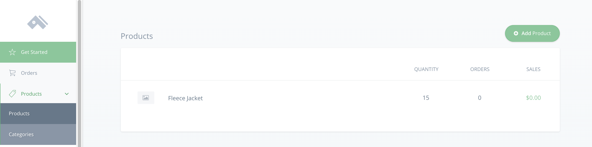

# Creating a Product Page with React and Three.js

This guide shows you how to set up a basic product page using React, Three.js, and React-Three-Fiber.

This guide uses v2 of the Commerce.js SDK.

[View the Live Demo]()


## Overview

Through this project, you will:

 * see how Commerce.js enables highly customized eCommerce sites
 * build an interactive product page with some basic 3D elements
 * use Commerce.js to provide data for your page
 * have a starting point for a project of your own.

### Requirements

You will need:
- your favorite code editor
- a [Chec Dashboard](https://authorize.chec.io/login) account
- Node.js
- npm/yarn

### Prerequisites

It will help to understand:
- JavaScript
- React
- Bootstrap


### Installing

To begin, you need to create a React application ([create-react-app](https://create-react-app.dev/docs/getting-started/) is an easy way to do this). Then install Commerce.js, Three.js, React Bootstrap, and React-Three-Fiber.

- Installing via SDK

```
npm install @chec/commerce.js three react-bootstrap react-three-fiber
```

You also need to insert a link to a bootstrap CDN in the index.html file in your project's public folder.
```
<link href="https://stackpath.bootstrapcdn.com/bootswatch/4.5.0/lux/bootstrap.min.css" rel="stylesheet" integrity="sha384-smnSwzHqW1zKbeuSMsAM/fMQpkk7HY11LuHiwT8snL/W2QBoZtVCT4H5x1CEcJCs" crossorigin="anonymous">
```
### Project usage

1. Uploading Products
If you haven't done so already, create a [Chec Dashboard](https://authorize.chec.io/login) account. Once you're logged in, navigate to 'Products.'



Click "Add Product" and enter the following:
* Product Name: Fleece Jacket
* Price: 60
* Product Description: Be better prepared for anything Mother Nature can throw at you with this fleece jacket. When you step outside and find adventure, know that this jacket will keep you feeling nice and toasty.

Then, click "Options" and:
* make a custom permalink called "Jacket"
* set the quantity to 15
* add a Variant "Color." In the description field, put "Blue" with a price of 60 and a quantity of 5.
* add two more colors "Red" and "Flax," each with a price of 60 and a quantity of 5. (The "Add Another" button is directly underneath the description field.)

Click "Save Changes" at the bottom of the page and open your code editor.


2. Seting up your file structure

If you used create-react-app, there are several files you won't need for this guide. You can delete everything in the src folder except index.js and App.js. Then, create a components folder with the following files:

```
src
|--components
|  |--Animation.js
|  |--Controls.js
|  |--Item.js
|  |--style.css
App.js
index.js
```

3. Using Commerce.js

In App.js, import Commerce and create your an object variable with your sandbox public key. (You can find your key in the [Developer section](https://dashboard.chec.io/setup/developer) of Chec Dashboard's 'Setup' tab).

The top of App.js should now look something like this:

```
import React from "react";
import Commerce from "@chec/commerce.js";

const commerce = new Commerce(
  "YOUR SANDBOX KEY GOES HERE"
);
```

Then import useState() and useEffect() from React, and set up a hook with 'products' and 'setProducts'. Then wrap the commerce object in the useEffect hook. Doing so tells React to do something after render— in this case, fetch data from commerce and update the state of 'products.'

```
import React, { useState, useEffect } from "react";
import Commerce from "@chec/commerce.js";

const commerce = new Commerce(
  "pk_test_18265006f98e5bc6f77efa3b7d99014bf7e1a31d0e6a3"
);

function App() {

  const [products, setProducts] = useState([]);

  useEffect(() => {
    commerce.products.list().then((res) => {
      setProducts(res.data);
    });
  }, []);

  return (
    <div></div>
  );
}

export default App;

```
[Check out the documentation](https://commercejs.com/docs/overview/getting-started.html) for Commerce to see more about the particular method we used and to see what else it can do for your eCommerce business.

4. Building the Item Page

Put the following code into Item.js:
```
import React, { useState } from "react";
import { Button, Col, Row } from "react-bootstrap";
import Animation from "./Animation";
import "./style.css";

function Item(props) {
  const [color, setColor] = useState("#80CED7");

  const description =
    props.description !== null
      ? props.description.slice(3, props.description.length - 4)
      : "";

  return (
    <Row className="item">
      <Col sm={6}>
        <Animation {...props} color={color} />
      </Col>
      <Col className="info">
        <h2>{props.name}</h2>
        <br />
        <br />
        <p>{description}</p>
        <Row className="buttonRow">
          <Col>
            <p>Available Colors:</p>
            <Button id="blue" onClick={() => setColor("#80CED7")}></Button>
            <Button id="flax" onClick={() => setColor("#E9D985")}></Button>
            <Button id="red" onClick={() => setColor("#BF211E")}></Button>
          </Col>
          <Col style={{ textAlign: "right" }}>
            <p>Price: {props.price.formatted_with_symbol}</p>
            <a href={props.checkout_url.display}>
              <Button id="buy" variant="primary">
                Buy Now
              </Button>
            </a>
          </Col>
        </Row>
      </Col>
    </Row>
  );
}

export default Item;
```
This component uses react-bootstrap's responsive grid and takes advantage of the useState hook to store different color options. These colors are passed to Animation.js via props, which makes it possible to change the color of our jacket.

5. Styling

Before going further, add the following css to style.css:
<details>
<summary>Click to expand styles</summary>

```body,
html,
canvas {
  width: 100vw;
  height: 100vh;
  margin:0;
  padding:0;
  background-color: #2D3047;
  background-image: linear-gradient(147deg, #2D3047 0%, #eae6e5 74%);
}

* {
  box-sizing: border-box;
}

.item {
  background: #fafdff;
}

h2 {
  text-align: center;
  margin-top: 50px;
}

.info {
  margin: 30px 30px 15px 0;
  padding: 30px;
}

.buttonRow {
  margin-top: 80px;
}

#blue {
  border-radius: 50%;
  width: 50px;
  height: 50px;
  margin-right: 10px;
  background-color: #80CED7;
}

#flax {
  border-radius: 50%;
  width: 50px;
  height: 50px;
  margin-right: 10px;
  background-color: #E9D985;
}

#red{
  border-radius: 50%;
  width: 50px;
  height: 50px;
  margin-right: 10px;
  background-color: #BF211E;
}

#buy{
  float:right;
  margin-top: 0px;
  border-radius: 7px;
}

@media screen and (max-width: 929px ) {
  #blue,
  #flax,
  #red,
  #buy {
    margin-top: 10px;
  }
}

@media screen and (max-device-width: 575px ) {
  canvas {
    width:100%;
    height: 100%;
  }
  .info {
    margin: 30px;
    padding: 30px;
  }
}
```
</details>

6. Mapping our product

Navigate back to App.js and map through products, passing props and rendering an Item for each product.
```
return (
    <div>
      {products.map((product) => (
        <Item key={product.id} {...product} />
      ))}
    </div>
  );
```

7.


End with linking an example of live project or demo.
[Live Demo]()


## Built With

List all frameworks/tools used.

* [Commerce.js](https://commercejs.com/) - eCommerce SDK
* [React.js](https://reactjs.org/) - The web framework used
* [React-Bootstrap](https://react-bootstrap.github.io/) - CSS framework for React
* [React-Three-Fiber](https://github.com/react-spring/react-three-fiber) - Reconciler for Three.js
* [Three.js](https://threejs.org/) - JavaScript 3D library

## Author

* **Craig Gant** - [Github](https://github.com/Andreloui5)

See also the list of [contributors](https://github.com/your/project/contributors) who participated in this project.

## Options

Add any additional customization notes if any.